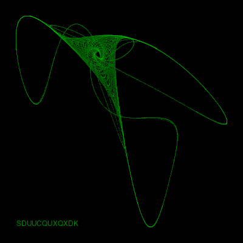

# quadrat
Sounds and moving pictures from quadratic difference equations.

### TLDR: Click the button to make random pictures and noises on [mybinder.org](https://mybinder.org/).
[](https://mybinder.org/v2/gh/augeas/quadrat/main?urlpath=notebooks%2Fimage.ipynb%3F%26autorun%3Dtrue)

In 1993, J. C. Sprott published [Automatic Generation of Strange Attractors](https://sprott.physics.wisc.edu/pubs/PAPER203.HTM), where chaotic maps are produced by iterating a reccurrence relation given by a pair of coupled quadratic difference equations:

$$
x_{n+1} = a_{1} + a_{2}x_{n} + a_{3}x_{n}^{2} + a_{4}x_{n}y_{n} + a_{5}y_{n} + a_{6}y_{n}^{2}
$$
$$
y_{n+1} = a_{7} + a_{8}x_{n} + a_{9}x_{n}^{2} + a_{10}x_{n}y_{n} + a_{11}y_{n} + a_{12}y_{n}^{2}
$$

However, one would prefer to consider this as the vectrorized operation:

$$
\Large{P_{n+1} = B + CV_{n}}
$$

$$
\Large{P_{n+1} = \begin{bmatrix} x_{n+1} \\ y_{n+1} \end{bmatrix}, B =  \begin{bmatrix} a_{1} \\ a_{7} \end{bmatrix}}, C =  \left[ \begin{array}{ccccccc} a_{2} & a_{3} & a_{4} & a_{5} & a_{6} \\
a_{8} & a_{9} & a_{10} & a_{11} & a_{12} \end{array} \right]
$$

$$
\Large{V_{n} = \begin{bmatrix} x_{n} \\ x_{n}^{2} \\ x_{n}y_{n} \\ y_{n} \\ y_{n}^{2} \\  \end{bmatrix}}
$$

In this way, attractors for many sets of coefficients can be iterated at once, using multi-dimensional numpy arrays
or torch tensors. If a secquence of points doesn't diverge, it is considered aesthetic if its
[Lyapunov exponent](https://en.wikipedia.org/wiki/Lyapunov_exponent) and
[Correlation dimension](https://en.wikipedia.org/wiki/Correlation_dimension) lie within a
certain range. Random searches of coefficients are performed,
where values from -1.2 to 1.2 in increments of 0.1 are assigned a letter from `A` to `Y`. The point sequences are
made into images by taking a histogram, so that points visited more frequently are brighter. Thus, a `SDUUCQUXQXDK` is:



## Making Sounds

The row and column of the histogram for each point in the sequence are considered as the real and imaginary
parts of one half of a complex spectrum, with the other half found by reflecting and taking the complex conjugate.
In this way, taking the inverse Fast Fourier Transform results in a real signal. The signals for each point
are multiplied by a [window function](https://en.wikipedia.org/wiki/Window_function), shifted by a series of
overlapping hops, and then summed and normalized. This is repeated for a second audio channel with the rows and
columns swapped.

### [This](SDUUCQUXQXDK.mp3) is what a `SDUUCQUXQXDK` sounds like.

## Playing with the Code

If you have [ffmpeg](https://ffmpeg.org/) you can play with different attractors, FFT sizes and hop sizes in
a [Jupyter notebook](https://youtu.be/7jiPeIFXb6U?si=UT9EJb59Btl3enID):

```bash
pip install -r requirements.txt
jupyter notebook --no-browser
```

Then you can play with a basic UI made with [ipwidgets](https://ipywidgets.readthedocs.io/en/latest/):
(Unfortunately, this is a bit flakey on [mybinder.org](https://mybinder.org/).)

```python
from quadrat.nb_app import SingleImageApp
SingleImageApp(player=True).show()
```
